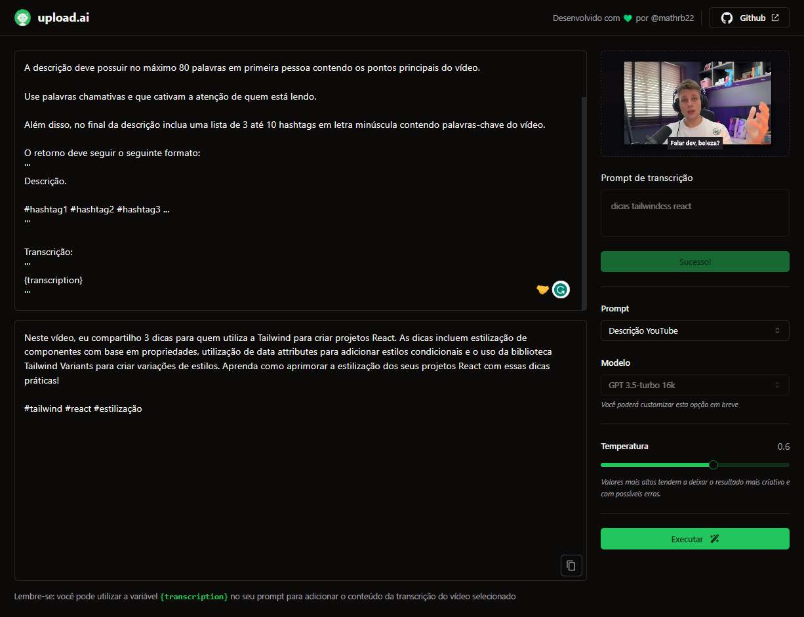

<div align="center">

<h1>upload.ai</h1>
</div>
<div align="center">
   <a href="https://github.com/mathrb22">
      
   </a>
   <a href="https://github.com/mathrb22/nlw-mastery-upload-ai/commits/main">
      
   </a>
   <a href="https://github.com/mathrb22/nlw-mastery-upload-ai/issues">
      
   </a>
   <a href="https://github.com/mathrb22/nlw-mastery-upload-ai/pulls">
      
   </a>
   <a href="https://github.com/mathrb22/nlw-mastery-upload-ai/blob/main/LICENSE">
      
   </a>
</div>

</br>
<div align="center">

[**Sobre**](#-sobre) &nbsp;&nbsp;**|**&nbsp;&nbsp;
[**Objetivo**](#-objetivo) &nbsp;&nbsp;**|**&nbsp;&nbsp;
[**Features**](#-features) &nbsp;&nbsp;**|**&nbsp;&nbsp;
[**Demonstração**](#-demonstração) &nbsp;&nbsp;**|**&nbsp;&nbsp;
[**Tecnologias e ferramentas**](#-tecnologias-e-ferramentas) &nbsp;&nbsp;**|**&nbsp;&nbsp;
[**Organização do projeto**](#-organização-do-projeto) &nbsp;&nbsp;**|**&nbsp;&nbsp;
[**Instalação e execução**](#-instalação-e-execução) &nbsp;&nbsp;**|**&nbsp;&nbsp;
[**Como contribuir**](#-como-contribuir) &nbsp;&nbsp;**|**&nbsp;&nbsp;
[**Licença**](#-licença)

</div>

## 📃 Sobre



**Upload.ai** é o projeto desenvolvido durante a trilha Mastery da **Next Level Week IA**, um evento online produzido pela [**Rocketseat**](https://github.com/Rocketseat).

Trata-se de uma aplicação que possibilita realizar upload de videos e por meio de IA, criar automaticamente títulos chamativos e descrições com um boa indexação.

## 🎯 Objetivo

O objetivo central do **Upload.ai** é criar uma plataforma que permita aos usuários realizar o upload de vídeos e, por meio de **IA** (Inteligência Artificial), gerar automaticamente títulos chamativos e descrições otimizadas para esses vídeos. Esta aplicação visa simplificar o processo de criação de conteúdo de vídeo e melhorar a visibilidade dos vídeos na web.

O projeto **Upload.ai** possui muitas aplicações práticas. Ele poderá ajudar criadores de conteúdo, profissionais de marketing, educadores online e empresas de mídia a melhorar a visibilidade e o desempenho de vídeos online, economizando tempo na criação de títulos e descrições atraentes e otimizadas para mecanismos de busca.

## ✨ Features

- [x] Upload de vídeos;
- [x] Conversão de vídeo para áudio utilizando o [**ffmpeg.wasm**](https://ffmpegwasm.netlify.app/);
- [x] Transcrição de áudio utilizando o [**Whisper (ASR - Automatic Speech Recognition)**](https://openai.com/research/whisper) da OpenAI;
- [x] Customização dos prompts;
- [x] Geração de resumo da transcrição utilizando o modelo GPT-3 da OpenAI;
- [x] Geração de títulos chamativos utilizando o modelo GPT-3 da OpenAI;
- [x] Geração de descrições otimizadas para SEO utilizando o modelo GPT-3 da OpenAI;
- [x] Flexibilidade para definir a temperatura (nível de aleatoriedade) dos resultados gerados (0-1);
- [x] Cópia dos resultados gerados pela IA para a área de transferência.

## 💻 Demonstração

https://github.com/mathrb22/nlw-mastery-upload-ai/assets/62413443/e7f4d886-dc36-4885-ad58-3ccbf0b4b031

## 🚀 Tecnologias e ferramentas

<table>
  <tbody>
    <tr>
      <td style="font-weight: bold">Front-end (web)</td>
      <td>
        <a href="https://reactjs.org/" target="_blank" rel="noopener noreferrer">React</a>,
        <a href="https://www.typescriptlang.org/" target="_blank" rel="noopener noreferrer">TypeScript</a>,
        <a href="https://tailwindcss.com/" target="_blank" rel="noopener noreferrer">TailwindCSS</a>,
        <a href="https://vitejs.dev/" target="_blank" rel="noopener noreferrer">Vite.js</a>,
        <a href="https://radix-ui.com/" target="_blank" rel="noopener noreferrer">Radix UI</a>,
        <a href="https://ffmpegwasm.netlify.app/" target="_blank" rel="noopener noreferrer">ffmpeg.wasm</a>,
        <a href="https://axios-http.com/" target="_blank" rel="noopener noreferrer">Axios</a>,
        <a href="https://www.npmjs.com/package/ai" target="_blank" rel="noopener noreferrer">Vercel AI SDK</a>
      </td>
    </tr>
    <tr>
      <td style="font-weight: bold">Back-end (API)</td>
      <td>
        <a href="https://nodejs.org/en/" target="_blank" rel="noopener noreferrer">Node.js</a>,
        <a href="https://www.typescriptlang.org/" target="_blank" rel="noopener noreferrer">TypeScript</a>,
        <a href="https://www.prisma.io/" target="_blank" rel="noopener noreferrer">Prisma</a>,
        <a href="https://www.fastify.io/" target="_blank" rel="noopener noreferrer">Fastify</a>,
        <a href="https://zod.dev/" target="_blank" rel="noopener noreferrer">Zod</a>,
        <a href="https://www.sqlite.org/index.html" target="_blank" rel="noopener noreferrer">SQLite</a>,
        <a href="https://www.npmjs.com/package/openai" target="_blank" rel="noopener noreferrer">OpenAI Node API</a>,
        <a href="https://www.npmjs.com/package/ai" target="_blank" rel="noopener noreferrer">Vercel AI SDK</a>
      </td>
    </tr>
  </tbody>
</table>

## 📂 Organização do projeto

Este repositório é dividido em dois principais diretórios:

- **api**: Contém o código-fonte do back-end.
- **web**: Contém o código-fonte do front-end.

## 🔧 Instalação e execução

Para baixar o código-fonte do projeto em sua máquina, primeiramente terá que ter instalado o [**Git**](https://git-scm.com/).
Com o Git instalado, em seu terminal execute o seguinte comando:

```bash
git clone https://github.com/mathrb22/nlw-mastery-upload-ai.git
```

Para instalar as dependências e executar o projeto terá que ter instalado em sua máquina o [**node.js**](https://nodejs.org/en/), que vem acompanhado do npm.

> Nesse projeto foi utilizado o [**pnpm**](https://pnpm.io/), que busca economizar espaço em disco e acelerar a instalação de pacotes devido à sua abordagem de armazenamento de dependências compartilhado.

### Front-end (Web)

Acesse a pasta do projeto:

```bash
cd web
```

Instale as dependências usando **pnpm** ou **npm**:

```bash
# pnpm
pnpm install

# npm
npm install
```

Executar o projeto:

```bash
# pnpm
pnpm run dev

# npm
npm run dev
```

A aplicação estará disponível em http://localhost:5173. Você poderá acessá-la a partir do seu navegador.

### Back-end (API)

Acesse a pasta do projeto:

```bash
cd api
```

Instale as dependências usando **pnpm** ou **npm**:

```bash
# pnpm
pnpm install

# npm
npm install
```

Crie o arquivo .env com as variáveis de ambiente necessárias:

```bash
DATABASE_URL="file:./dev.db"
OPENAI_KEY="sua OpenAI key"
```

Rode o comando a seguir para gerar o client do Prisma:

```bash
# pnpm
pnpm prisma generate

# npm
npm prisma generate
```

Execute as migrations do banco de dados:

```bash
# pnpm
pnpm prisma migrate dev

# npm
npm prisma migrate dev
```

Execute o projeto:

```bash
# pnpm
pnpm run dev

# npm
npm run dev
```

O servidor estará disponível em http://localhost:3333.

## 💡 Como contribuir

- Faça um **_fork_** desse repositório;
- Crie um **branch** para a sua feature: `git checkout -b minha-feature`;
- Faça um **commit** com suas alterações: `git commit -m 'feat: Minha nova feature'`;
- Faça um **push** para o seu branch: `git push origin minha-feature`;
- Faça um **pull request** com sua feature;

Pull requests são sempre bem-vindos. Em caso de dúvidas ou sugestões, crie uma _**issue**_ ou entre em contato comigo.

## 📝 Licença

<a href="https://github.com/mathrb22/nlw-mastery-upload-ai/blob/main/LICENSE">
    
</a>

Esse projeto está sob a licença **MIT**. Veja o arquivo _**LICENSE**_ para mais detalhes.

---

Desenvolvido com 💚 por <a href="https://github.com/mathrb22/">mathrb22</a>

<div style="display: flex;">
  <a href="https://www.linkedin.com/in/madalena-machado-rocha/" target="_blank"></a>
  <a href="mailto:math.ribeiro.dev@gmail.com"></a>
</div>
